## Transactional Fraud Prevention System v.1.0.1


The project, in addition to its primary goal of learning and experimentation, also aims to provide a comprehensive solution for the detection and prevention of fraud in financial transactions, integrating Machine Learning, business rules, and advanced statistical analyses. The solution includes an interactive dashboard for real-time monitoring, exploratory analysis, and alert management.

## About the Project
This system is being developed to detect and prevent fraud in financial transactions with high accuracy, reducing false positives while maintaining a seamless experience for legitimate users. The solution integrates multiple technologies and approaches:

- Supervised and unsupervised Machine Learning models
- Customizable and dynamic business rules engine
- Advanced statistical and exploratory analyses
- Interactive web dashboard for monitoring and management
- Automated data pipeline for real-time processing
- Intelligent alert system with different priority levels

## Visual Demonstration of the System
The system provides a complete and intuitive web interface through a Streamlit dashboard. Below are the main screens and functionalities:

### 1. Execution

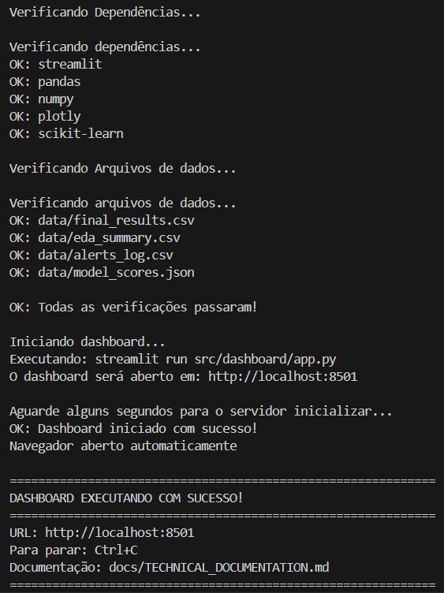

- Dependency check completed: All required libraries (Streamlit, Pandas, NumPy, Plotly, Scikit-learn) are installed.
- Data files successfully located: The required .csv and .json files for the dashboard were found in the data/ directory.
- Dashboard successfully launched via Streamlit: The command streamlit run src/dashboard/app.py was executed correctly.
- Local access to the dashboard: The dashboard was automatically opened in the browser at http://localhost:8501.
- Documentation available: The technical documentation is located at docs/TECHNICAL_DOCUMENTATION.md.

### 2. Real-Time Monitoring Dashboard

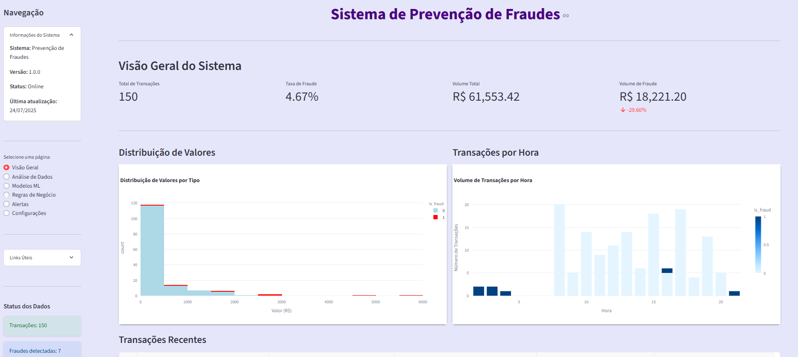

The monitoring dashboard displays:
- Model performance metrics for fraud detection
- Real-time transaction charts
- Indicators of active and pending alerts
- Geographic distribution of transactions
- Timeline of detected fraud events

### 3. Exploratory Data Analysis

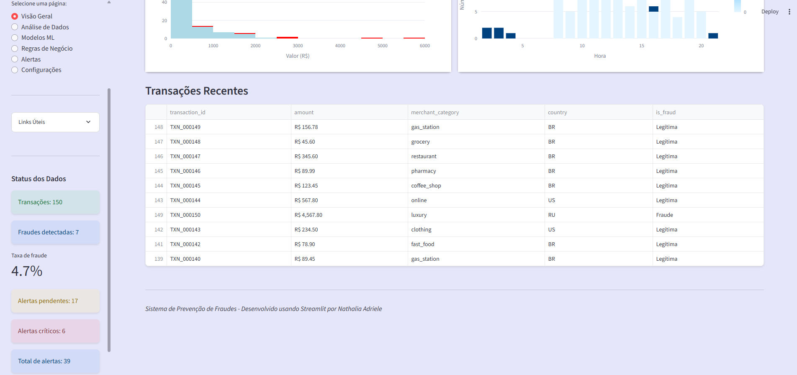

The data analysis section offers:
- Interactive charts showing the distribution of transaction values
- Temporal analysis of fraud patterns
- Correlations between different variables
- Detailed descriptive statistics
- Visualizations of outliers and anomalies

### 4. Analysis by Merchant Category

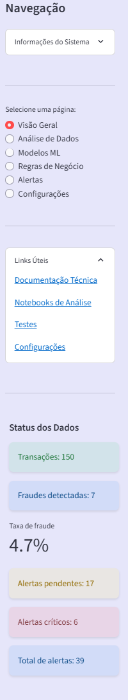

This screen presents:
- Distribution of fraud cases by merchant category
- Fraud rate specific to each type of merchant
- Comparative bar charts
- Insights into higher-risk categories
- Recommendations based on the identified patterns

### 5. Temporal Analysis and Patterns

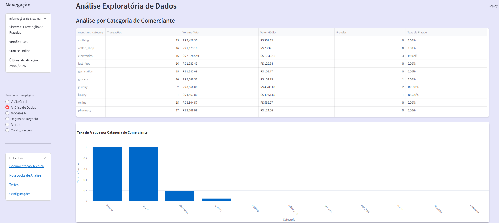

The temporal analysis shows:
- Fraud patterns over time
- Seasonality and trends
- Peak times for fraudulent activity
- Comparisons between periods
- Forecasts based on historical data

### 6. Machine Learning Models

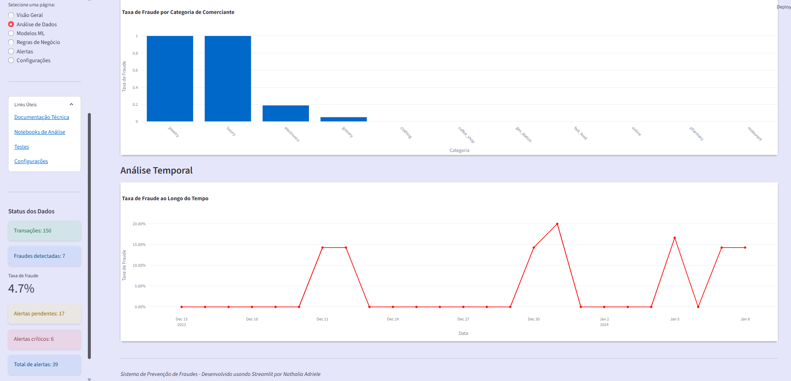

The models section presents:
- Comparative performance across different algorithms
- Precision, recall, and F1-score metrics
- ROC and Precision–Recall curves
- Feature importance for each model
- Configurations and parameters of the trained models

### 7. Business Rules System

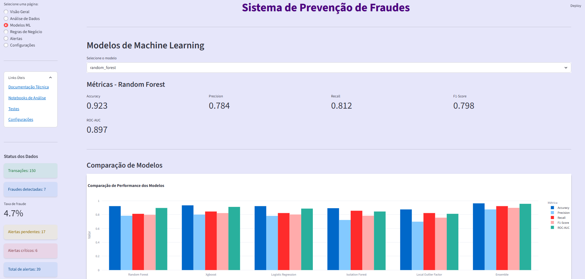

The rules system offers:
- An interface for creating and editing custom rules
- Conditional logic for different scenarios
- Configurable thresholds for alerts
- History of rule application
- Validation and testing of new rules

### 8. Alert Management

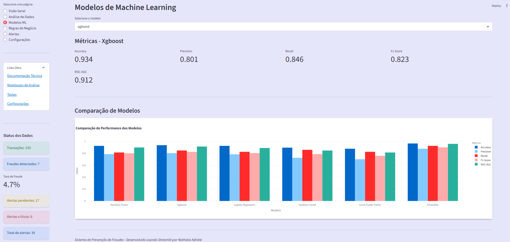

The alert system includes:
- A list of active alerts with different priority levels
- Filters by status, type, and time period
- Detailed view of each alert with transaction context
- Available actions for each alert
- Resolution history and feedback

### 9. Geographic Analysis

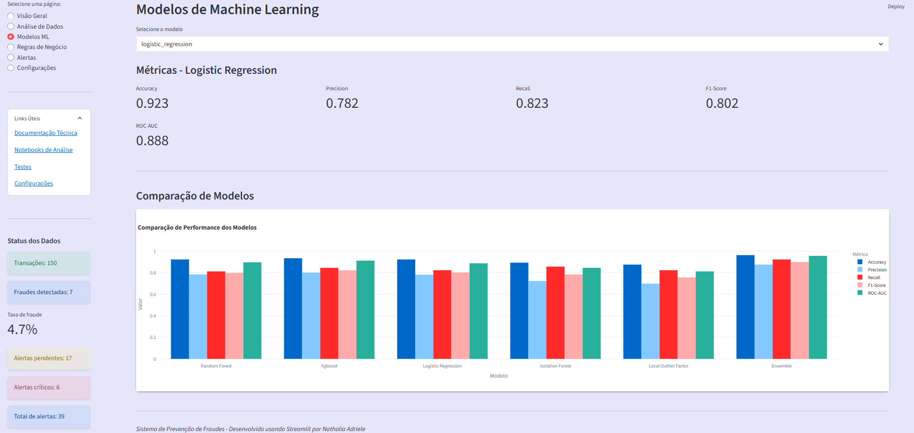

The geographic analysis shows:
- Map of transaction distribution by country/region
- Identification of suspicious geographic patterns
- Fraud rate by location
- Alerts for transactions in unusual locations
- Visualization of suspicious transaction routes

### 10. System Settings

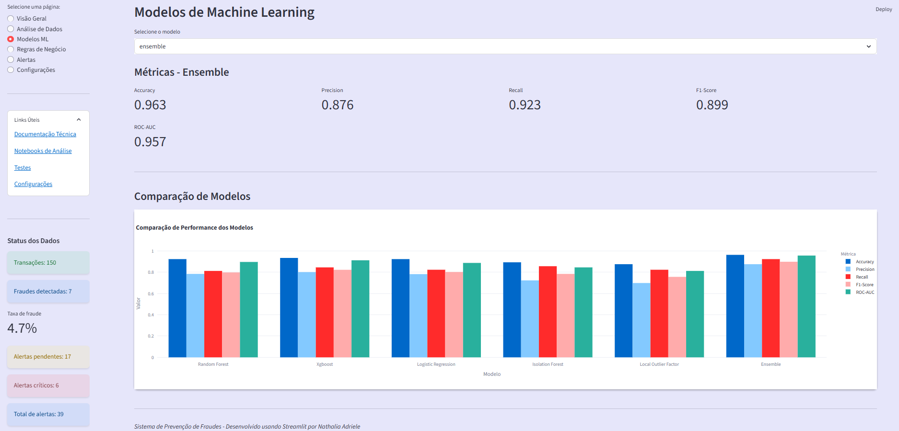

The settings screen allows:
- Uploading new datasets for analysis
- Configuration of model parameters
- Adjustment of detection thresholds
- Configuration of notifications and alerts
- Backup and restore of settings

### 11. Reports and Detailed Metrics

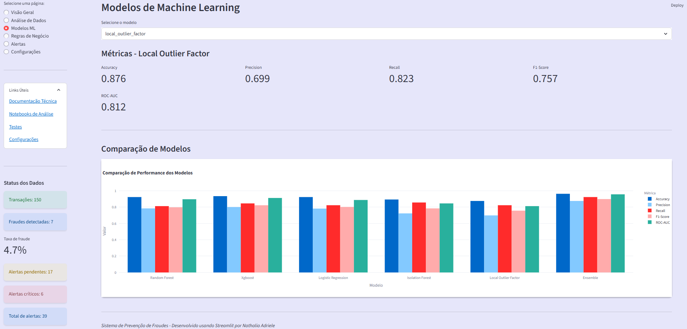

The reports include:
- Detailed model performance metrics
- In-depth analysis of false positives and false negatives
- Identification of long-term trends
- Comparisons across different observation periods
- Export of results for external analysis

### 12. Individual Transaction Analysis

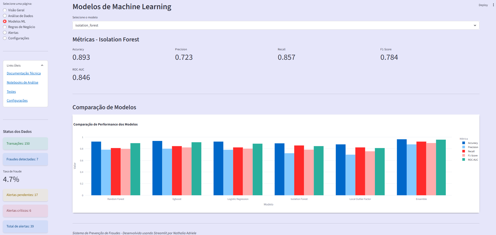

The individual analysis shows:
- Complete details of each transaction
- Risk score calculated by the models
- Factors that contributed to the classification
- User history and behavioral patterns
- Recommended actions based on the analysis

### 13. Executive Dashboard

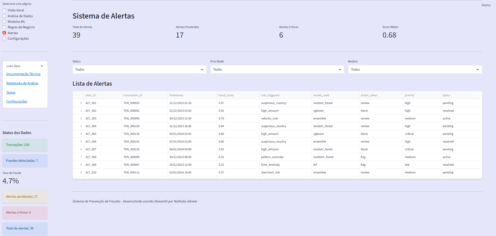

The executive dashboard presents:
- Key KPIs to support management
- Consolidated summary of system performance
- Estimated financial impact achieved through fraud prevention
- Identified trends and future projections
- Strategic recommendations for decision-making

### 14. Navigation Interface and Menu

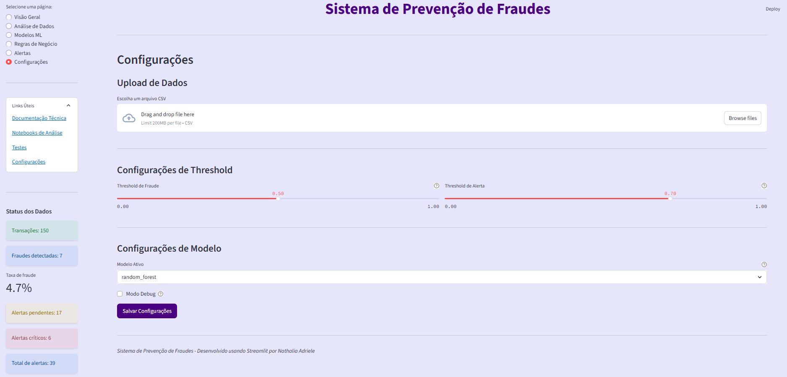

The navigation interface offers:
- An intuitive sidebar menu for quick access
- Real-time system status
- Connectivity and performance information
- Links to documentation and support
- Visual indicators of system status and alerts

## Installation and Execution

### Method 1: Automated Script (Recommended)

```bash
# Clone the repository
git clone https://github.com/nathadriele/transaction_fraud_prevention_pipeline
cd transacional_fraud_prevention_pipeline

# Run the automated initialization script
python start_dashboard.py
```

The automated script will:
- Check the Python version
- Install missing dependencies
- Configure the environment
- Automatically start the dashboard
- Open the browser at the correct URL

### Method 2: Docker

```bash
# Build e execução com Docker Compose
docker-compose up -d

# Acesse: http://localhost:8501
```

### Method 3: Manual Installation

```bash
# Install the dependencies
pip install -r requirements.txt

# Set up the environment
cp config/config.example.yaml config/config.yaml

# Run the dashboard
streamlit run src/dashboard/app.py
```

**Dashboard available at: http://localhost:8501**

### Key Features
#### Fraud Detection
- Supervised Models: Random Forest, XGBoost, Logistic Regression
- Anomaly Detection: Isolation Forest, Local Outlier Factor
- Behavioral Analysis: User and transaction patterns
- Real-Time Scoring: Instant risk classification
- Model Ensemble: Intelligent combination of multiple algorithms

#### Business Rules System
- Customizable Engine: Creation of business-specific rules
- Smart Alerts: Based on dynamic thresholds
- Conditional Logic: Complex rules with multiple conditions
- Exception Management: Handling of special cases
- Automated Validation: Testing the effectiveness of rules

#### Dashboard and Monitoring
- Interactive Web Interface: Responsive Streamlit dashboard
- Real-Time Metrics: Automatically updated KPIs
- Advanced Visualizations: Interactive charts with Plotly
- Exploratory Analysis: Data investigation tools
- Executive Reports: Summaries for decision-making

#### Data Pipeline
- Synthetic Data Generation: Creation of realistic datasets
- Automated Preprocessing: Data cleaning and transformation
- Feature Engineering: Creation of predictive variables
- Quality Validation: Data integrity checks
- Automated ETL: Extraction, transformation, and loading

#### Alert System
- Priority Classification: Critical, High, Medium, Low
- Real-Time Notifications: Instant alerts
- Workflow Management: Resolution tracking
- Complete History: Full traceability of all actions
- External Integration: APIs for third-party systems

### Technologies Used
#### Core
- Python 3.9+ – Primary programming language
- Streamlit – Web dashboard framework
- Docker – Containerization and deployment

#### Machine Learning
- scikit-learn – Classical ML algorithms
- XGBoost – Optimized gradient boosting
- TensorFlow – Deep learning and neural networks
- imbalanced-learn – Handling imbalanced datasets

#### Data Analysis
- pandas – Structured data manipulation
- numpy – Numerical computing
- scipy – Advanced statistical analysis
- matplotlib/seaborn – Static visualizations

#### Visualization
- Plotly – Interactive charts
- Streamlit – Responsive web interface
- Jupyter – Notebooks for exploratory analysis

#### Development
- pytest – Testing framework
- black – Code formatting
- flake8 – Linting and code quality
- pre-commit – Validation hooks

### How to Use the System
#### 1. Accessing the Dashboard
- After installation, go to http://localhost:8501 to open the main dashboard.

#### 2. Navigation
- Use the sidebar menu to navigate between the different sections:
- Overview: Key metrics and system status
- Data Analysis: Data exploration and visualization
- ML Models: Model performance and configuration
- Rules: Business rules management
- Alerts: Alert monitoring and management
- Settings: Configuration and data upload

#### 3. Transaction Analysis
- View transactions in real time
- Analyze patterns and trends
- Identify anomalies and fraud
- Configure custom alerts

#### 4. Model Management
- Compare performance across models
- Adjust parameters and thresholds
- Retrain models with new data
- Monitor drift and degradation

#### 5. Rules Configuration
- Create custom business rules
- Define conditions and actions
- Test rules before deployment
- Monitor rule effectiveness

### Analysis Notebooks
The project includes Jupyter notebooks for exploratory analysis:

#### 1. Exploratory Data Analysis
jupyter notebook notebooks/01_exploratory_data_analysis.ipynb

- Descriptive statistics
- Distribution visualizations
- Correlation analysis
- Pattern identification

#### 2. Fraud Modeling
jupyter notebook notebooks/02_fraud_detection_modeling.ipynb

- Model training
- Cross-validation
- Hyperparameter optimization
- Performance evaluation

#### 3. System Demonstration
jupyter notebook notebooks/03_fraud_prevention_demo.ipynb

- Practical use cases
- Scenario simulations
- Implementation examples
- Integration tests

### Testing and Quality
Running Tests
#### Run all tests
pytest tests/

#### Run with coverage
pytest tests/ --cov=src --cov-report=html

#### Specific tests
pytest tests/test_business_rules.py
pytest tests/test_data_loader.py

- Performance Metrics
- Precision: > 95%
- Recall: > 90%
- F1-Score: > 92%
- False Positive Rate: < 2%
- Latency: < 100 ms
- Throughput: > 1,000 transactions/second

### Technical Documentation
Available Guides

- Deployment Guide
 – Complete deployment instructions

- Technical Documentation
 – Architecture and implementation

- Configurations
 – System configuration files

- Notebooks
 – Exploratory analysis and modeling

### Data Structure
- The system works with the following data types:
   - Transactions: Financial transaction data
   - Users: Profile and behavioral information
   - Alerts: Records of suspicious events
   - Models: ML metrics and configurations
   - Rules: Business rule definitions

### APIs and Integrations
   - REST API: Endpoints for external integration
   - Webhooks: Real-time notifications
   - Batch Processing: Batch processing
   - Stream Processing: Real-time data analysis

### Use Cases
#### 1. Real-Time Detection
   - Immediate analysis of ongoing transactions
   - Automatic blocking of potentially fraudulent activities
   - Instant notifications to responsible teams
#### 2. Investigative Analysis
   - Investigation of suspicious patterns
   - Forensic fraud analysis
   - Detailed reports for auditing
#### 3. Risk Management
   - Monitoring risk KPIs
   - Adjustment of security policies
   - Optimization of business rules
#### 4. Compliance and Auditing
   - Full traceability of decisions
   - Reports for regulatory bodies
   - Process documentation

### Contribution
#### How to Contribute
- Fork the project
- Create a branch for your feature (git checkout -b feature/NewFeature)
- Commit your changes (git commit -m 'Add new feature')
- Push to the branch (git push origin feature/NewFeature)
- Open a Pull Request

### Project Status
- Current Version: 1.0.1
- Status: Under update / maintenance

### Last Update: 19/12/2025


**Sistema de Prevenção de Fraudes** - Protegendo transações financeiras com inteligência artificial e análise avançada de dados. **Desenvolvido principalmente com foco no aprendizado**.
